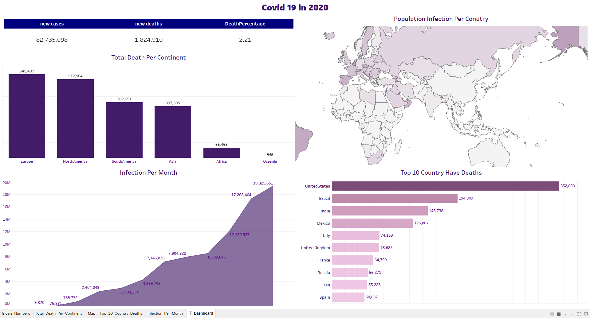

# COVID-19 Analysis (2020)

**Dashboard Preview:**

🔗[View Interactive Dashboard on Tableau Public](https://public.tableau.com/views/covid_19_dashboard_17596977407930/Dashboard?:language=en-US&:sid=&:redirect=auth&:display_count=n&:origin=viz_share_link)


## Problem

In 2020, the COVID-19 pandemic spread worldwide, affecting millions of people.
The goal of this project is to **analyze global COVID-19 data** to understand infection and death trends.

 ---

## Data
- **Source:** COVID-19 dataset extracted from a database (`covid_19.coviddeaths`).
- **Data Content:** Includes columns for date, continent, location, population, new cases, and new deaths.
- **Data Period:** Year 2020.

---

## Tools
- **SQL**  for extracting and aggregating the required data.
- **Excel** for data cleaning and preparing the dataset.
- **Tableau** for building the interactive dashboard and data visualization.

---

## Preparation
- Removed null and inconsistent values.
- Verified data types for date and numeric columns.
- Aggregated data by **continent** and **country** using SQL queries.
- Cleaned and organized the final dataset in **Excel** for visualization.

---

## Analysis

#### 1- Total Cases, Deaths & Death Percentage

``` sql
SELECT
    SUM(new_cases) AS total_cases,
    SUM(new_deaths) AS total_deaths,
    (SUM(new_deaths) / SUM(new_cases)) * 100 AS DeathPercentage
FROM 
    covid_19.coviddeaths;
 ```

#### 2- Total Deaths Per Continent

``` sql
SELECT
continent, SUM(new_deaths) AS total_death
FROM covid_19.coviddeaths
GROUP BY continent
ORDER BY total_death;

```
#### 3- Infection Percentage by Country

```sql
SELECT
location,
population,
MAX(total_cases) AS Highest_Total_Cases,
MAX(ROUND((total_cases / population) * 100, 2)) AS Infection_Percetage
FROM covid_19.coviddeaths
GROUP BY location, population
ORDER BY Infection_Percetage DESC;
```

---
## Results
The **Tableau Dashboard** visualizes the global situation for 2020:
- Total global cases: **82,735,098**
- Total deaths: **1,824,910**
- Global death rate: **2.21%**
- **Europe** and **North America** recorded the highest death counts.
- **United States**, **Brazil**, and **India** were the top three countries with the most deaths.
- Infection rate increased dramatically in the last quarter of 2020.

---

## Recommendations
- Focus more on healthcare capacity and early detection systems in regions with high fatality rates.
- Continuous global data collection and real-time dashboards can help predict and respond faster to future - Public awareness and vaccination campaigns should target countries with rapidly rising infection trends.

